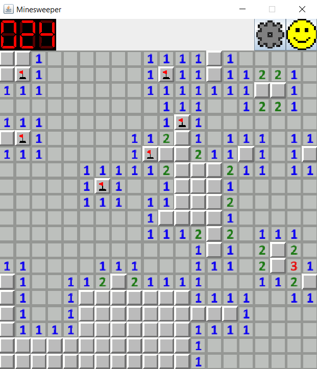
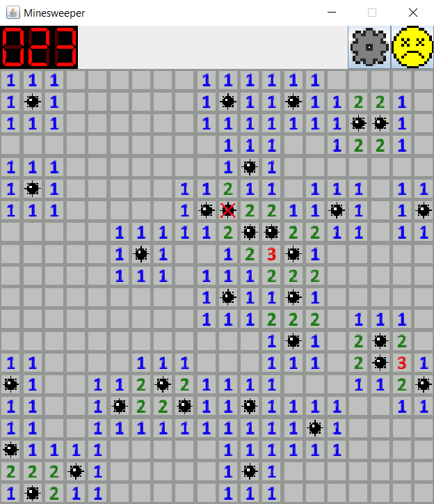

# Java-Minesweeper

A minimal Minesweeper in Java and Swing made as a project for the Prog1 programming course for L3 students at ENS de Lyon and inspired by the original Windows 98 app.

## Features

### Custom boards
The user may customize the number of rows, columns and mines within reasonable limits.

### Multiplayer mode
2 to 10 players compete on the same machine in a turn-based game on the same board. Points are obtained by correctly flagging mines and revealing empty cells.
Losing the game or incorrectly flagging mines comes with a malus.

### Hardcore mode
The number of mines is randomly selected uniformly between 15% and 30% coverage of the whole board. The user may place as many flags as they wish, but the mines counter is disabled.

## Versions

Features contained in every release version correspond to the different implementation steps required by the programming course. `v1.x` versions implement basic functionality, `v2.x` versions implement customization options, and `v3.x` versions implement offline multiplayer gameplay.

## Gallery

